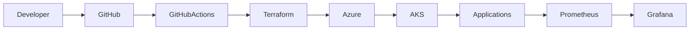

# Enterprise Architecture Overview

## Architecture Principles

- Infrastructure as Code
- Immutable deployments
- GitOps-first
- Least privilege
- Zero Trust
- Observability by default

## Platform Flow

